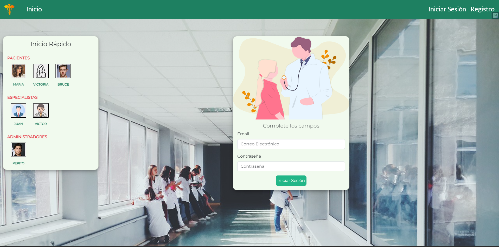
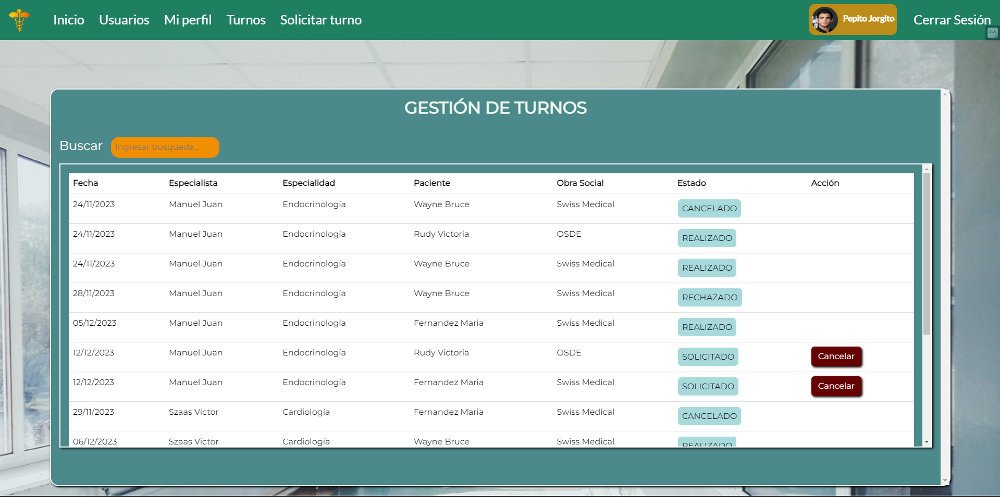

# Trabajo Práctico FINAL - Julian Leandro Nieva

**“La Clínica Online, especialista en salud, cuenta actualmente con consultorios (6 en la actualidad),
dos laboratorios (físicos en la clínica), y una sala de espera general. Está abierta al público de lunes a
viernes en el horario de 8:00 a 19:00, y los sábados en el horario de 8:00 a 14:00.
Trabajan en ella profesionales de diversas especialidades, que ocupan los consultorios acorde a su
disponibilidad, y reciben en ellos pacientes con turno para consulta o tratamiento. Dichos turnos son
pedidos por la web seleccionando el profesional o la especialidad. La duración mínima de un turno es
30 minutos.” pero los profesionales pueden cambiar la duración según su especialidad. Estos
profesionales pueden tener más de una especialidad.
También contamos con un sector dentro de la clínica que se encarga de la organización y
administración de la misma".**

### Icono

  

# INICIO
### La primera vista que tendra el usuario al no tener su sesión iniciada sera una Bienvenida con dos botones que le permitan redirigirse al Login o al Registro

# REGISTRO
### En la página de registro nos encontramos con la seleccion de dos tipos de usuarios. Al seleccionar un usuario se mostrara el formulario correspondiente

## REGISTRO PACIENTE

## REGISTRO ESPECIALISTA

# INICIAR SESIÓN
### En la página de iniciar sesión nos encontraremos con un formulario a completar y un total de 6 botones que permitan el acceso rápido

# VISTA ADMINISTRADOR
### Al iniciar sesión como Administrador contara con las siguientes opciones de interacción : *Usuarios - Mi Perfil - Turnos - Solicitar Turno*

## Vista Usuarios
### Desde aca podemos ver el listado de todos los usuarios. Se puede habilitar o deshabilitar un Especialista. Revisar el historial clinico de un Paciente, y descargar sus turnos. Tambien podemos registrar a un nuevo usuario siguiendo el criterio anterior, pero con la oportunidad de registrar a un administrador

## Registro de Admin

#

## Vista Mi Perfil
### En esta sección el Administrador podra ver la informacion de su cuenta

## Vista Turnos
### En esta sección el Administrador podra ver todos los turnos dentro de la Clinica

## Vista Solicitar Turno
### En esta sección el Administrador podra solicitar un Turno para un Paciente que seleccione

### Selección de Especialidad, una vez que el Administrador haya seleccionado a un Paciente, se le muestra el listado de Especialidades. La vista del Paciente al solicitar turno comienza desde aqui

### Una vez seleccionada la Especialidad, se mostrara los Especilistas que trabajen con la especialidad seleccionada

### Como vista final, Si selecciono a un Especialista, se mostrara los turnos que tiene disponibles

# VISTA PACIENTE
### Al iniciar sesión como Paciente contara con las siguientes opciones de interacción : *Mi Perfil - Mis Turnos - Solicitar Turno*

## Vista Mi Perfil
### En esta sección el Paciente podra ver la informacion de su cuenta, y si tiene al menos un Historial Clinico, podra visualizarlo y descargarlo

## Vista Mis Turnos
### En esta sección el Paciente podra ver los turnos que haya solicitado 

# VISTA ESPECIALISTA
### Al iniciar sesión como Especialista contara con las siguientes opciones de interacción : *Mi Perfil - Mis Turnos - Mis Pacientes*

## Vista Mis Turnos
### En esta sección el Especialista podra ver los turnos que le fueron solicitados y cargar Historial Clinico a un Paciente

## Vista Mis Pacientes
### En esta sección el Especialista podra el Historial Clinico de un Paciente, siempre y cuando haya completado un turno con este último

## Vista Mi Perfil
### En esta sección el Especialista podra ver su informacion personal y crear Turnos

 Instalacion Angular 

# Clinica

This project was generated with [Angular CLI](https://github.com/angular/angular-cli) version 16.2.0.

## Development server

Run `ng serve` for a dev server. Navigate to `http://localhost:4200/`. The application will automatically reload if you change any of the source files.

## Code scaffolding

Run `ng generate component component-name` to generate a new component. You can also use `ng generate directive|pipe|service|class|guard|interface|enum|module`.

## Build

Run `ng build` to build the project. The build artifacts will be stored in the `dist/` directory.

## Running unit tests

Run `ng test` to execute the unit tests via [Karma](https://karma-runner.github.io).

## Running end-to-end tests

Run `ng e2e` to execute the end-to-end tests via a platform of your choice. To use this command, you need to first add a package that implements end-to-end testing capabilities.

## Further help

To get more help on the Angular CLI use `ng help` or go check out the [Angular CLI Overview and Command Reference](https://angular.io/cli) page.

